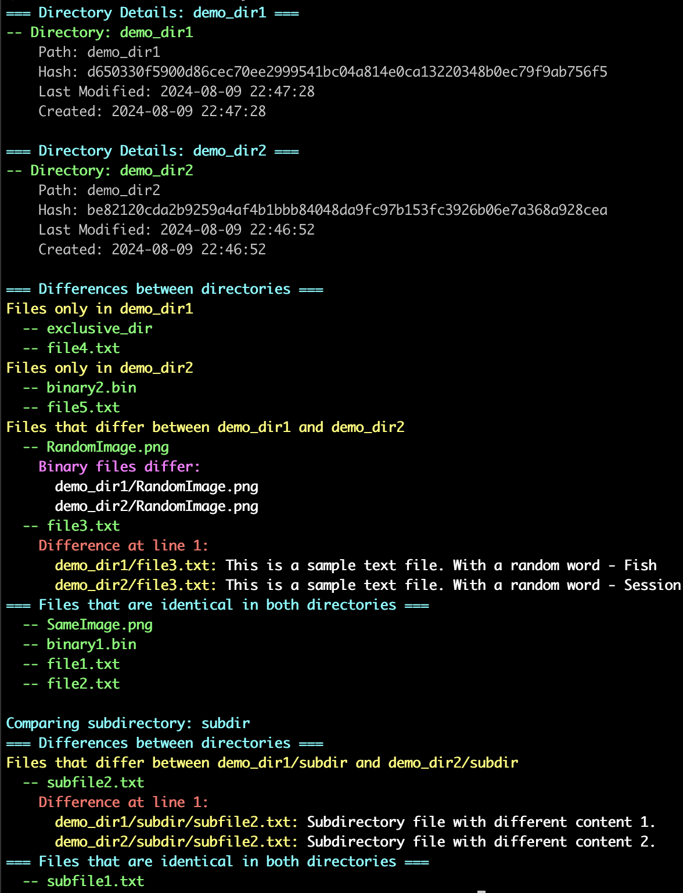

# Dir-Diff

## Install
```
git clone https://github.com/nikon-63/dir-diff.git

cd dir-diff

pip install .
```

## Uninstall
```
pip uninstall dir-diff
```

## Usage
```
usage: dir-diff [-h] [-v] dir1 dir2

Compare two directories and show differences.

positional arguments:
  dir1           First directory to compare
  dir2           Second directory to compare

options:
  -h, --help     show this help message and exit
  -v, --verbose  Print all differences
```